# 3D Sound Localization

---

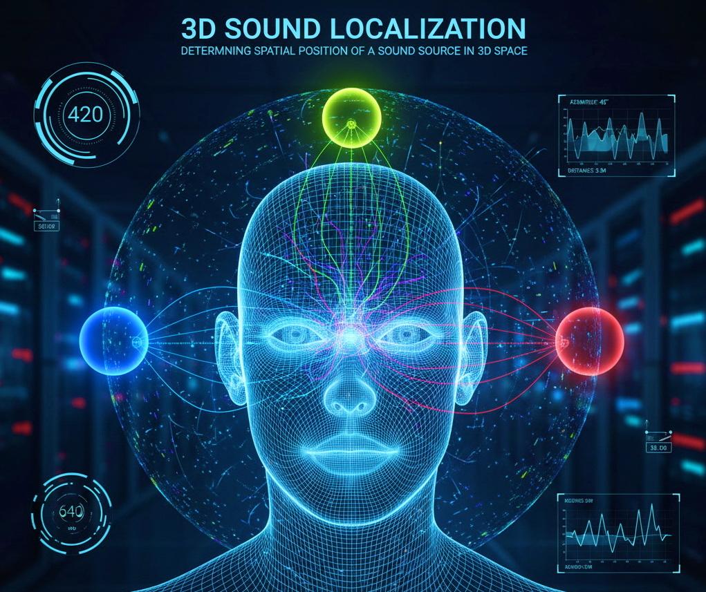

## Introduction

3D sound localization refers to the process of determining the spatial position of a sound source in three-dimensional space. 
This involves estimating both the direction (elevation and azimuth angles) and sometimes the distance of the sound source relative to an array of microphones or a listener. 
The human auditory system performs this naturally through binaural hearing, while technological solutions use sensor arrays 
and signal processing algorithms to emulate or surpass these capabilities.

## Main Techniques in 3D Sound Localization

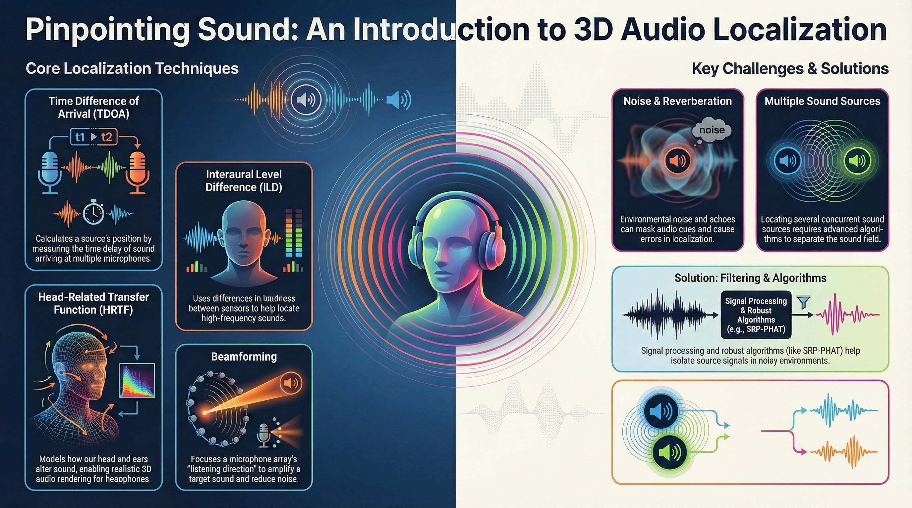

Multiple physical cues and digital processing techniques make precise sound localization possible:

1. **Time-Difference-of-Arrival (TDOA)**
    Principle: Measures the difference in arrival time of a sound wave at multiple microphones.
    Usage: Comparing these delays enables triangulation of the source position.
    Application: Widely used in microphone arrays, surveillance, and robotics.

2. **Level Differences**
    Interaural Level Difference (ILD): The difference in loudness and frequency between microphones, exploited for high-frequency localization.

3. **Phase and Frequency Cues**
    Interaural Phase Difference (IPD): Used for localization of low-frequency sounds.

4. **Head-Related Transfer Function (HRTF)**
    Overview: Models how sound interacts with the human head and ears, encoding critical spectral cues.
    Application: Employed in binaural audio systems and 3D headphone audio rendering.

5. **Beamforming and Array Processing**
    Principle: Algorithms focus the “listening direction” of the array, amplifying signals from specific regions and attenuating off-axis noise.
    Use cases: Real-time tracking and spatial filtering in advanced microphone arrays.

6. **Object-Based and Virtual Audio Rendering**
    Object-based audio: Positions discrete audio sources in 3D space.
    Virtual reproduction: Uses HRTF and signal processing to simulate sources from multiple directions with headphones or a small number of speakers.

## Challenges in Localization

1. **Noise and Reverberation**
    Problem: Environmental noise and echoes can mask localization cues and introduce errors.
    Solutions:
        Signal processing filters (bandpass, adaptive) to isolate key frequency bands.
        Beamforming to enhance source direction and suppress off-axis noise.
        Robust algorithms (e.g., SRP-PHAT, MUSIC) that stay reliable in reverberant environments.

2. **Array Geometry and Resolution**
    Optimal arrangement: Correct positioning and sufficient spacing of microphones are crucial for high resolution.
    Limitations: Arrays that are too small/large or with too few sensors may suffer from reduced accuracy or practical difficulties.

3. **Source Multiplicity and Separation**
    Issue: Localizing several concurrent sound sources is challenging.
    Approach: Advanced algorithms can decompose the sound field or select the strongest sources.

		
## Denoising and Noise Reduction

    Frequency filtering: Bandpass filters isolate frequency bands of interest.
    Spatial filtering: Array processing emphasizes signals from a specific direction.
    Post-processing: Statistical or machine learning models provide robustness to complex environments.

## Detailed Python Program Descriptions

- Localization3DOfSound.py: This program performs 3D localization of a sound source using an array of three microphones. 
The script can either generate synthetic test signals or work with existing audio recordings from the microphones. 
It optionally applies a bandpass filter for noise reduction, computes the time differences of arrival (TDOA) between the signals,
and estimates the 3D position of the sound source. Additionally, the program calculates and outputs the elevation (θ) and azimuth (φ) angles 
of the sound source with respect to the microphone plane, providing a full spherical direction indication.
 
- Localization3DOfSoundWithNCapteurs.py: This program performs 3D acoustic source localization using an arbitrary number of microphones positioned uniformly on the surface of a sphere.
The script processes the recorded signals from all microphones, detects the strongest sound sources, and estimates their spatial directions 
and positions relative to the center of the sphere. For each detected source, the program outputs both its Cartesian coordinates and its spherical angles (elevation θ and azimuth φ).
The signal processing includes optional bandpass filtering and a simple beamforming algorithm (SRP-PHAT-style) to locate multiple concurrent sources.

- Localization3DOfSoundWithNCapteurs3DView.py: This program simulates a spherical microphone array and synthesizes impulse signals from multiple sound sources located at random distances
and directions around it. It implements a simplified Steered Response Power Phase Transform (SRP-PHAT) beamforming algorithm to scan a spatial grid 
and estimate the directions of dominant sound sources. The program identifies the top strongest source directions while avoiding duplicates close in angle. 
Finally, it visualizes the microphone positions on the sphere and the probable source locations in 3D, accurately reflecting their estimated directions and simulated distances.
This approach is useful for robust 3D sound source localization in reverberant environments.

## A short course for more information

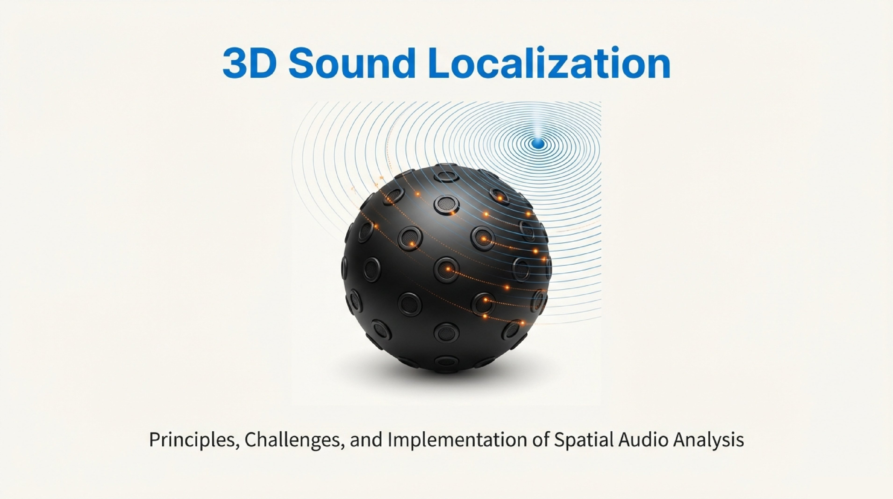

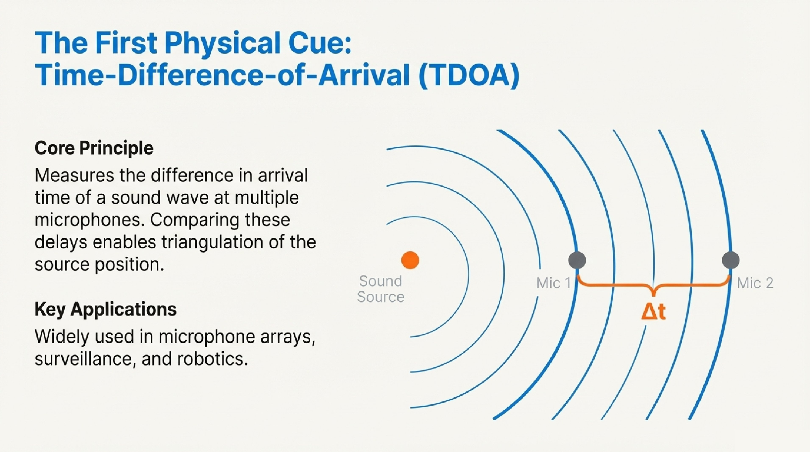
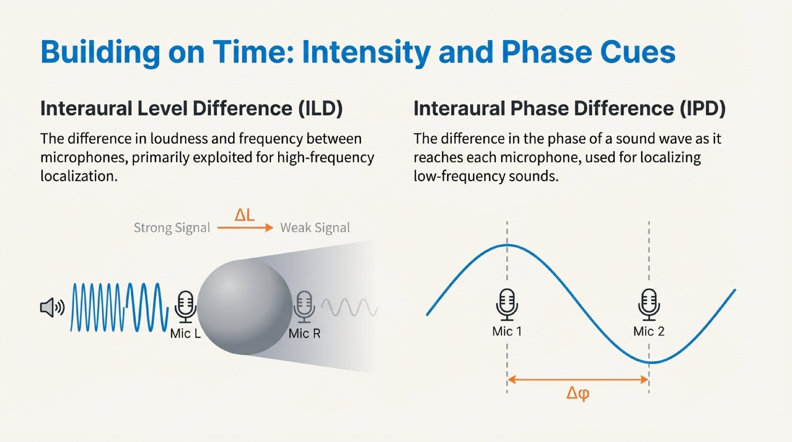
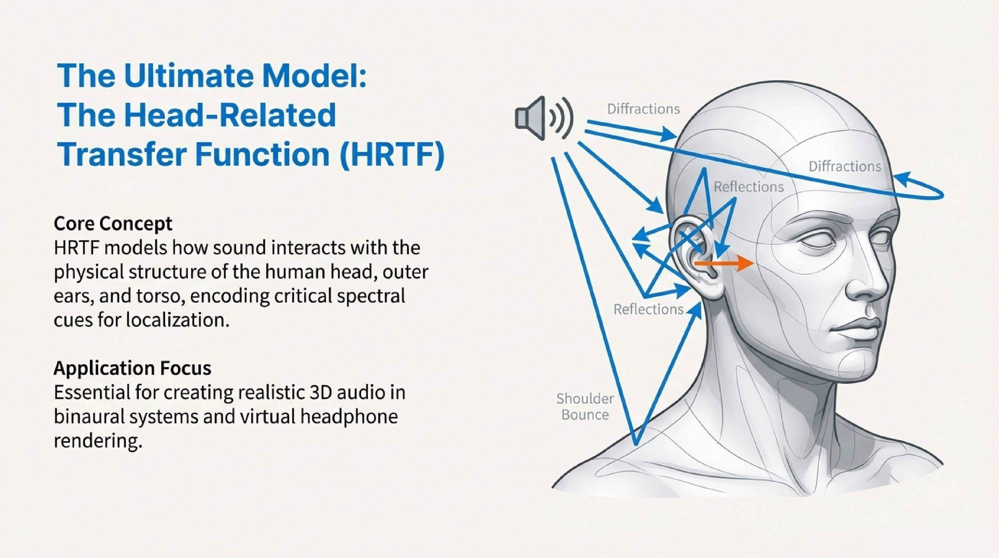
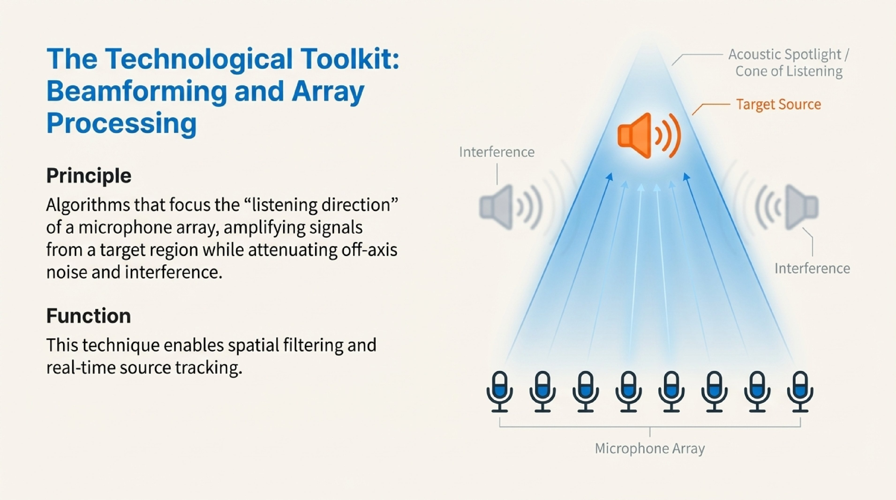
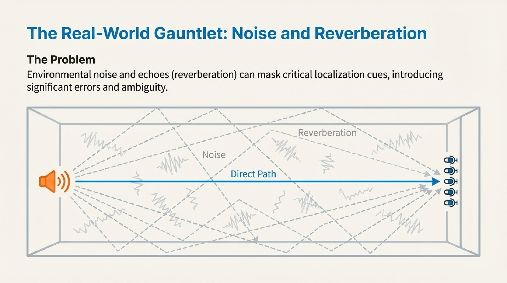
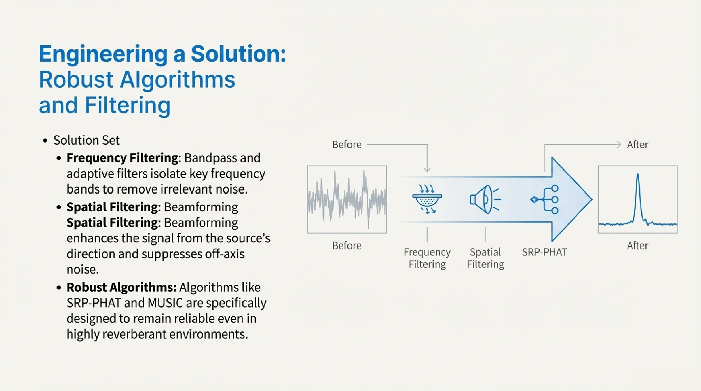
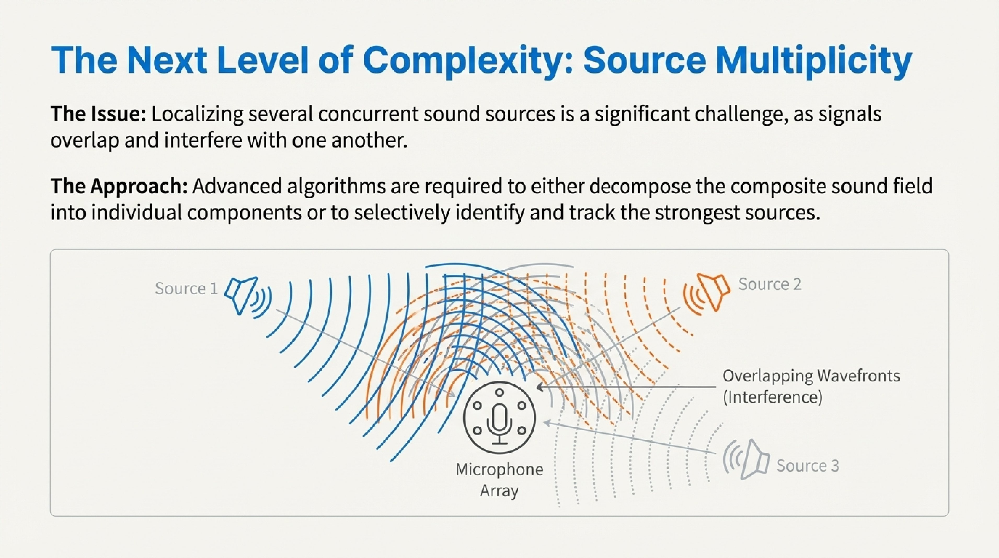

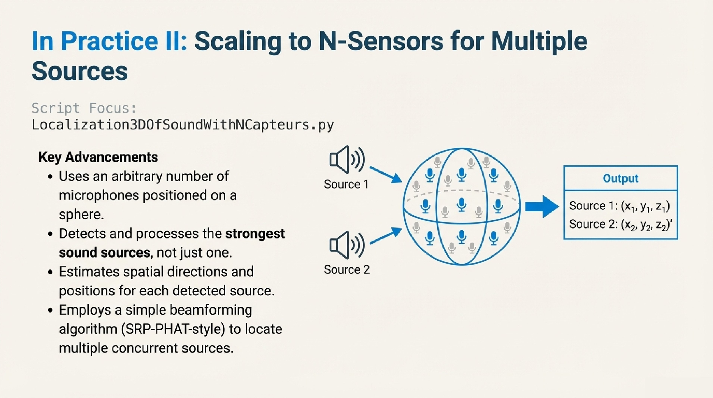

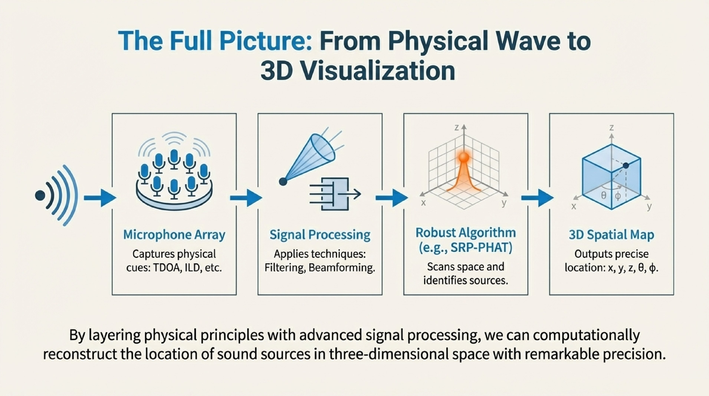

---

## 📝 **Author**

**Dr. Patrick Lemoine**  
*Engineer Expert in Scientific Computing*  
[LinkedIn](https://www.linkedin.com/in/patrick-lemoine-7ba11b72/)

---

 
 
